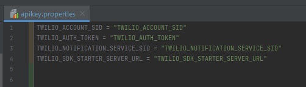

# AssistGo! Android App

AssistGo! is a mobile application that makes the communication features of a phone out-of-the-box accessible. The standard Android user interface is overcrowded with unnecessary features and configurations that take away from the primary purpose of a cell phone: communication for daily and emergency use. Android provides users the ability to make their device more accessible with a multitude of accessibility configurations. However, it requires users to be aware of these options and be able to manually adjust them to their needs. This accessibility solution provided by Android creates a large barrier of knowledge.

AssistGo! leverages a simple user interface so users with accessibility issues such as visual impairments, limited literacy, and language barriers can easily access primary functions of communication such as voice/video calls and chat. AssistGo! makes it easy for users to add, edit and remove contacts, in addition to providing in-app translation features so those that may have a language barrier can translate without needing a third party. Users are also able to call the local emergency services without the need to look up the service numbers. At a high level, AssistGo! provides users with a simpler way to communicate.

## Technologies

- Android SDK
- XML
- Java
- Twilio Video API
- Google Speech to Text

## Prerequisites

- Java needs to be installed on version 11
- Android Studio needs to be installed
- Android Studio Emulator needs to be on API version 30 or You need a physical android device
- Also follow the instructions below to set up Twilio Video Chat:

### Configure account information

Every sample in the demo requires some basic credentials from your Twilio account. Configure these first.

| Config Value         | Description                                                                                                           |
| :------------------- | :-------------------------------------------------------------------------------------------------------------------- |
| `TWILIO_ACCOUNT_SID` | Your primary Twilio account identifier - find this [in the console here](https://www.twilio.com/console).             |
| `TWILIO_API_KEY`     | Used to authenticate - [generate one here](https://www.twilio.com/console/dev-tools/api-keys).                        |
| `TWILIO_API_SECRET`  | Used to authenticate - [just like the above, you'll get one here](https://www.twilio.com/console/dev-tools/api-keys). |

#### A Note on the Information Above

Put the information above in the `apikey.properties` file in the root directory of this project in this format:

<p align="center">
  
</p>

#### A Note on API Keys

When you generate an API key pair at the URLs above, your API Secret will only be shown once -
make sure to save this information in a secure location, or possibly your `~/.bash_profile`.

### Configure product-specific settings

Depending on which demos you'd like to run, you may need to configure a few more values in your
`.env` file.

### Configuring Twilio Sync

Twilio Sync works out of the box, using default settings per account. Once you have your API keys configured and your Java application built and running, [open a browser](http://localhost:4567/sync)!

### Configuring Twilio Chat

In addition to the above, you'll need to [generate a Chat Service](https://www.twilio.com/console/chat/services) in the Twilio Console. Put the result in your `.env` file.

| Config Value              | Where to get one. |
| :------------------------ | :---------------- | --------------------------------------------------------------------------------------- |
| `TWILIO_CHAT_SERVICE_SID` | Chat              | [Generate one in the Twilio Chat console](https://www.twilio.com/console/chat/services) |

### Configuring Twilio Notify

You will need to create a Notify Service and add at least one credential on the [Mobile Push Credential screen](https://www.twilio.com/console/notify/credentials) (such as Apple Push Notification Service or Firebase Cloud Messaging for Android) to send notifications using Notify.

| Config Value                      | Where to get one.                                                                                                               |
| :-------------------------------- | :------------------------------------------------------------------------------------------------------------------------------ |
| `TWILIO_NOTIFICATION_SERVICE_SID` | Generate one in the [Notify Console](https://www.twilio.com/console/notify/services) and put this in your `.env` file.          |
| A Push Credential                 | Generate one with Apple or Google and [configure it as a Notify credential](https://www.twilio.com/console/notify/credentials). |

Once you've done that, run the application and [open a browser](localhost:4567/notify)!

## Run the sample application

[Sample Application](https://github.com/TwilioDevEd/sdk-starter-java)

This application uses the lightweight [Spark Framework](http://www.sparkjava.com), and
requires Java 8.

Edit `.env` with the four configuration parameters we gathered from above.

Now that the application is configured, we need to install our dependencies from Maven.

```bash
mvn install
```

And compile our application code:

```bash
mvn package
```

Now we should be all set! Run the application using the `java -jar` command.

```bash
java -jar target/sdk-starter-1.0-SNAPSHOT.jar
```

Your application should now be running at [http://localhost:4567/](http://localhost:4567/).


Check your config values, and follow the links to the demo applications!

## Running the SDK Starter Kit with ngrok

If you are going to connect to this SDK Starter Kit with a mobile app (and you should try it out!), your phone won't be able to access localhost directly. You'll need to create a publicly accessible URL using a tool like [ngrok](https://ngrok.com/) to send HTTP/HTTPS traffic to a server running on your localhost. Use HTTPS to make web connections that retrieve a Twilio access token.

```bash
ngrok http 4567
```

## Instructions to compile and run code

**Final Result
**
